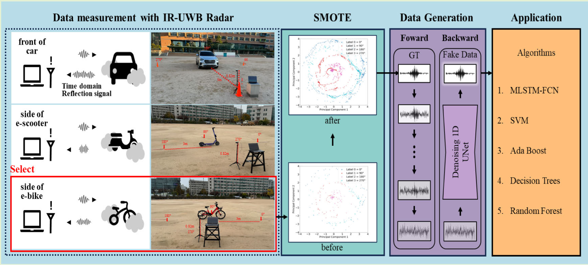

## 📄 SMOTE-Diffusion: Data Augmentation for Imbalanced Datasets

### Reference Paper
- **SMOTE-Diffusion: An Over-Sampling Method Using Diffusion Models for Imbalanced Data**  
  [https://doi.org/10.1109/JSEN.2025.3544753](https://doi.org/10.1109/JSEN.2025.3544753)

### Overview
- **SMOTE-Diffusion** combines SMOTE (Synthetic Minority Over-sampling Technique) with **Diffusion Models** to generate synthetic samples for minority classes.
- **Goal**: Address class imbalance and enhance dataset diversity.
- **Applications**: IR-UWB radar object recognition, multi-sensor fusion, small-scale datasets.

### Repository Structure
- `smote_diffusion.py`: Core pipeline integrating SMOTE and diffusion model.
- `train.py`: Training script for the diffusion model.
- `generate.py`: Synthetic sample generation script.
- `evaluate.py`: Evaluation script to assess classification performance using augmented data.
- `dataset/`: Example datasets for experiments.

### Key Features
- Continuous latent space sampling using diffusion models.
- Captures complex data distributions beyond classical SMOTE.
- Generates data-driven synthetic samples via deep learning.

### Dependencies

python train.py --epochs 100
python generate.py --num_samples 500
python evaluate.py --model resnet --dataset dataset/sample.csv

